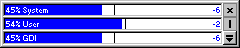



## Online Resource and Memory Meter

### Description

Shows Win9x resources level (System, User and GDI). Ofcause it will not work on NT, because it does not handle resources the same way as Win95. Included is some usercontrols, like: PopDown, ProgressGuage, Coolbutton and TrayIcon. So if you do not want it for the resource meter, you can always download it for the other source. Executable is enclosed. Besides resources it also shows memory information, allows you to mark current resource level (great to check for resource leaks in your program). It is a "finished" program, so you can use it straight away.
 
### More Info
 

             |
---                |---
**Submitted On**   |2000-01-13 14:09:14
**By**             |[Tony](https://github.com/Planet-Source-Code/PSCIndex/blob/master/ByAuthor/tony.md)
**Level**          |Intermediate
**User Rating**    |4.7 (80 globes from 17 users)
**Compatibility**  |VB 5\.0, VB 6\.0
**Category**       |[Complete Applications](https://github.com/Planet-Source-Code/PSCIndex/blob/master/ByCategory/complete-applications__1-27.md)
**World**          |[Visual Basic](https://github.com/Planet-Source-Code/PSCIndex/blob/master/ByWorld/visual-basic.md)
**Archive File**   |[CODE\_UPLOAD28361132000\.zip](https://github.com/Planet-Source-Code/tony-online-resource-and-memory-meter__1-5453/archive/master.zip)

